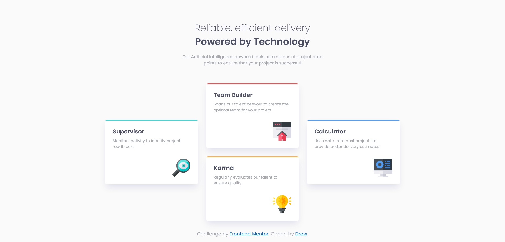

# Frontend Mentor - Four card feature section solution

This is a solution to the [Four card feature section challenge on Frontend Mentor](https://www.frontendmentor.io/challenges/four-card-feature-section-weK1eFYK). Frontend Mentor challenges help you improve your coding skills by building realistic projects.

## Table of contents

- [Overview](#overview)
  - [The challenge](#the-challenge)
  - [Screenshot](#screenshot)
  - [Links](#links)
- [My process](#my-process)
  - [Built with](#built-with)
  - [What I learned](#what-i-learned)
  - [Continued development](#continued-development)
- [Author](#author)

<br>

---

## Overview

### The challenge

Users should be able to:

- View the optimal layout for the site depending on their device's screen size

### Screenshot



### Links

- Solution URL: [Add solution URL here](https://your-solution-url.com)
- Live Site URL: [Add live site URL here](https://your-live-site-url.com)

---

## My process

### Built with

- Semantic HTML5 markup
- CSS
- Flexbox
- Mobile-first workflow
- Sass (Scss)

<br>

### What I learned

This challenge gave me a bit of a hard time, but it was fun and I learned a lot on the proccess!

I'm still new to responsive layouts, but I feel I have a better grasp right now. I also used some stuff that I don't use often, like ::before pseudo-element for the top color bars on the cards.

```scss
.card::before {
  position: absolute;
  content: "";
  height: 0.23rem;
  width: 100%;
  top: 0;
}
```

<br>

### Continued development

While I'm still not 100% confortable with pseudo-elements, I will keep working with them on a daily basis. Not only because they make the html cleaner, but because of the incredible stuff you can do with them. I'll also keep working to improve my flexbox skills, as well as building responsive layouts.

<br>

---

## Author

- Website - [Add your name here](https://www.your-site.com)
- Frontend Mentor - [@yourusername](https://www.frontendmentor.io/profile/yourusername)
- Twitter - [@yourusername](https://www.twitter.com/yourusername)
